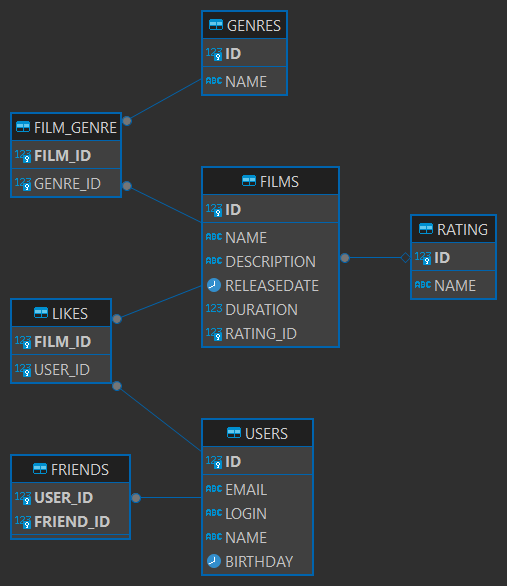

# java-filmorate

Template repository for Filmorate project.



Примеры типовых запросов:

- Выбрать пользователя по идентификатору:
  ```sql
  select * from USERS where id = ?
  ```
- Выбрать фильм по идентификатору:
  ```sql
  select * from FILMS where id = ?
  ```